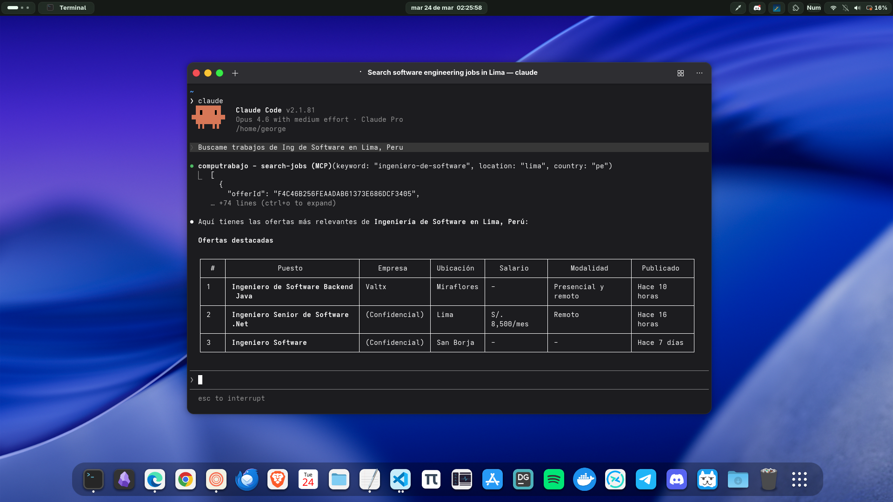
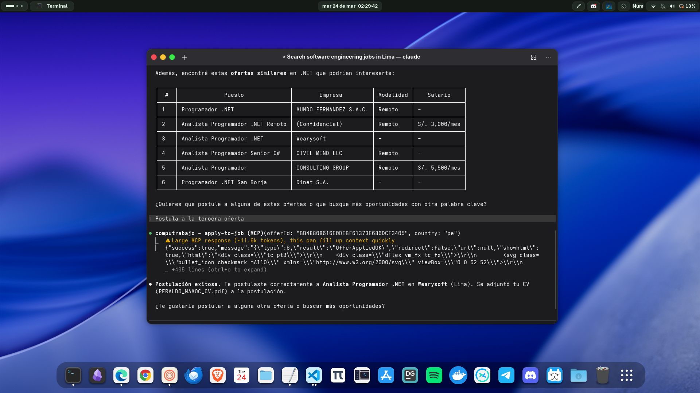
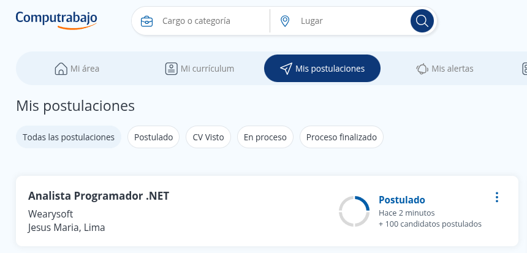

#  MCP Computrabajo

> A Model Context Protocol (MCP) server for searching and applying to jobs on Computrabajo, Latin America's largest job board

[](https://www.npmjs.com/package/mcp-computrabajo)
[](https://www.typescriptlang.org/)
[](https://bun.sh)
[](https://modelcontextprotocol.io)
[](https://opensource.org/licenses/MIT)

- **English**: [README.md](README.md) (You are here)
- **Español**: [README.es.md](README.es.md)

**MCP Computrabajo** is a Model Context Protocol server that provides AI assistants with access to [Computrabajo](https://www.computrabajo.com/) job listings. Search for jobs, view full details, and apply — all through standardized MCP tools.

---

## What can you do with this MCP?

- **Search job listings** by keyword and location across multiple countries
- **View full job details** including description, requirements, salary, benefits, and company info
- **Apply to jobs** directly using your authenticated Computrabajo session

---

## Quick Start

### Prerequisites

- [Bun](https://bun.sh) v1.2.10+ or Node.js v18+
- An MCP-compatible client (Claude Desktop, Claude Code, etc.)
- A [Computrabajo](https://www.computrabajo.com/) account with active session cookies

### Getting your session cookies

1. Log in to [Computrabajo](https://www.computrabajo.com/) in your browser
2. Open DevTools (F12) → Network tab
3. Navigate to any page on Computrabajo
4. Right-click a request → Copy as cURL
5. Extract the cookie string from the `-b` or `--cookie` flag

### Option 1: Claude Desktop (Recommended)

Open your Claude Desktop configuration file:

- **macOS**: `~/Library/Application Support/Claude/claude_desktop_config.json`
- **Windows**: `%APPDATA%\Claude\claude_desktop_config.json`
- **Linux**: `~/.config/Claude/claude_desktop_config.json`

```json
{
  "mcpServers": {
    "computrabajo": {
      "command": "npx",
      "args": ["mcp-computrabajo@latest"],
      "env": {
        "CT_COOKIES": "ut=...; uca=...; ncac=...; nca=...; trl=...",
        "CT_COUNTRY": "pe"
      }
    }
  }
}
```

Restart Claude Desktop. You'll see an MCP indicator when the server is connected.

### Option 2: Claude Code

```bash
claude mcp add --transport stdio \
  --env CT_COOKIES="ut=...; uca=...; ncac=...; nca=...; trl=..." \
  --env CT_COUNTRY=pe \
  computrabajo -- npx mcp-computrabajo@latest
```

### Option 3: Claude Desktop (with Bun)

```json
{
  "mcpServers": {
    "computrabajo": {
      "command": "bun",
      "args": ["/absolute/path/to/mcp-computrabajo/src/index.ts"],
      "env": {
        "CT_COOKIES": "ut=...; uca=...; ncac=...; nca=...; trl=...",
        "CT_COUNTRY": "pe"
      }
    }
  }
}
```

### Option 4: Claude Code (with Bun)

```bash
claude mcp add --transport stdio \
  --env CT_COOKIES="ut=...; uca=...; ncac=...; nca=...; trl=..." \
  --env CT_COUNTRY=pe \
  computrabajo -- bun /absolute/path/to/mcp-computrabajo/src/index.ts
```

### Option 5: Clone and run locally

```bash
git clone https://github.com/georgegiosue/mcp-computrabajo.git
cd mcp-computrabajo
bun install
```

> **Tip:** Use the MCP Inspector for debugging: `bun run inspect`

---

## Authentication

Cookies are **only required for applying to jobs** (`apply-to-job`). Searching and viewing job details work without authentication.

### Cookie resolution order

The MCP reads cookies from the first available source:

1. `CT_COOKIES` environment variable
2. File at `CT_COOKIES_FILE` environment variable
3. `~/.computrabajo/cookies.txt`

## Environment Variables

| Variable | Required | Default | Description |
|----------|----------|---------|-------------|
| `CT_COOKIES` | No | — | Full cookie string from your browser session |
| `CT_COOKIES_FILE` | No | `~/.computrabajo/cookies.txt` | Path to a file containing the cookie string |
| `CT_COUNTRY` | No | `pe` | Country code: `pe`, `co`, `mx`, `ar`, `cl`, `ec` |

---

## Available Tools

| Tool | Description | Parameters |
|------|-------------|------------|
| `search-jobs` | Search job listings by keyword and location | `keyword`, `location?`, `country?`, `page?` |
| `get-job-detail` | Get full details of a job offer | `offerId`, `country?` |
| `apply-to-job` | Apply to a job offer (requires auth) | `offerId`, `country?` |

---

## Screenshots

### Searching for jobs


### Applying to a job


### Confirmation on Computrabajo


---

## Usage Examples

Once connected, you can ask Claude naturally:

- *"Search for software jobs in Lima"*
- *"Find remote Python developer jobs in Peru"*
- *"Show me the details of this job offer"*
- *"Apply to this job for me"*
- *"Search for marketing jobs in Trujillo, page 2"*

---

## Supported Countries

| Code | Country |
|------|---------|
| `pe` | Peru |
| `co` | Colombia |
| `mx` | Mexico |
| `ar` | Argentina |
| `cl` | Chile |
| `ec` | Ecuador |

---

## Project Structure

```
mcp-computrabajo/
├── src/
│   ├── config/                        # API configuration & cookie handling
│   ├── domain/
│   │   ├── models/                    # Domain model interfaces
│   │   └── ports/                     # Repository interface (contract)
│   ├── infrastructure/
│   │   ├── http/                      # HTTP repository (fetch + cheerio)
│   │   └── mcp/
│   │       └── tools/
│   │           ├── index.ts           # Registers all tools
│   │           ├── tool.ts            # Tool interface + register() helper
│   │           ├── error.ts           # Shared errorResponse()
│   │           └── job/
│   │               ├── search-jobs/
│   │               ├── get-job-detail/
│   │               └── apply-to-job/
│   ├── shared/                        # Shared utilities
│   └── index.ts                       # MCP server entry point
├── package.json
└── tsconfig.json
```

---

## Development

```bash
# Install dependencies
bun install

# Run with MCP Inspector
bun run inspect

# Format code
bun run format

# Build
bun run build
```

---

## Contributing

1. Fork the repository
2. Create a feature branch (`git checkout -b feature/new-feature`)
3. Format your code (`bun run format`)
4. Commit your changes
5. Open a Pull Request

---

## License

MIT License - see [LICENSE](LICENSE) for details.

---

## Acknowledgments

- [Computrabajo](https://www.computrabajo.com/) — Latin America's largest job board
- [Model Context Protocol](https://modelcontextprotocol.io) — MCP specification
- [Bun](https://bun.sh) — Fast JavaScript runtime
